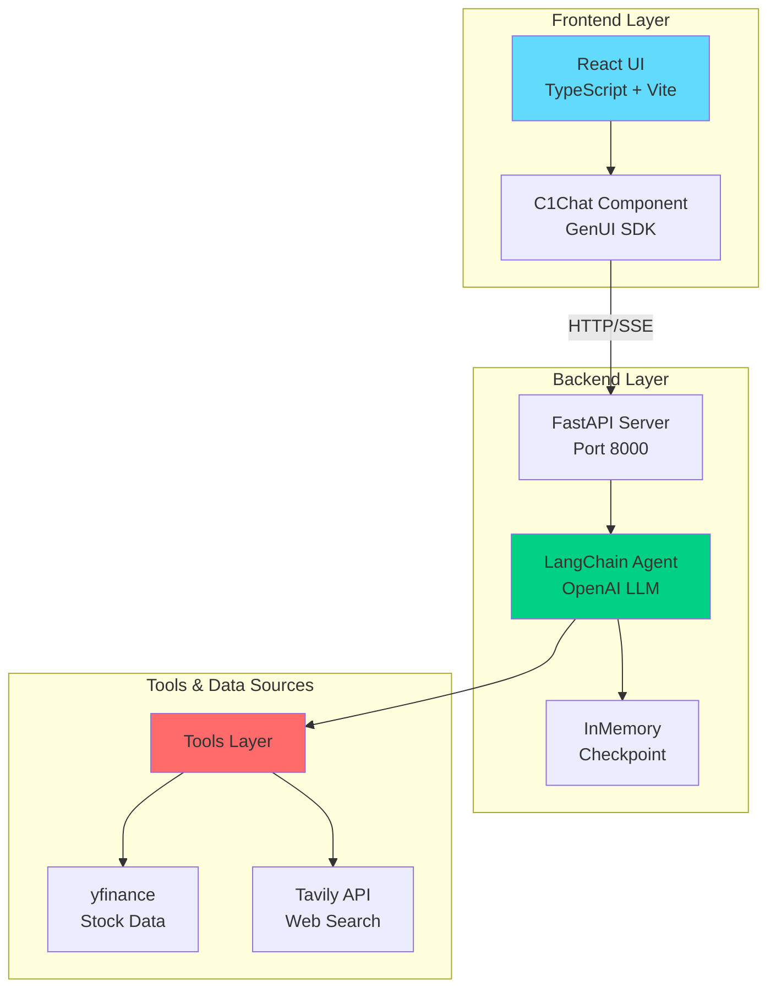
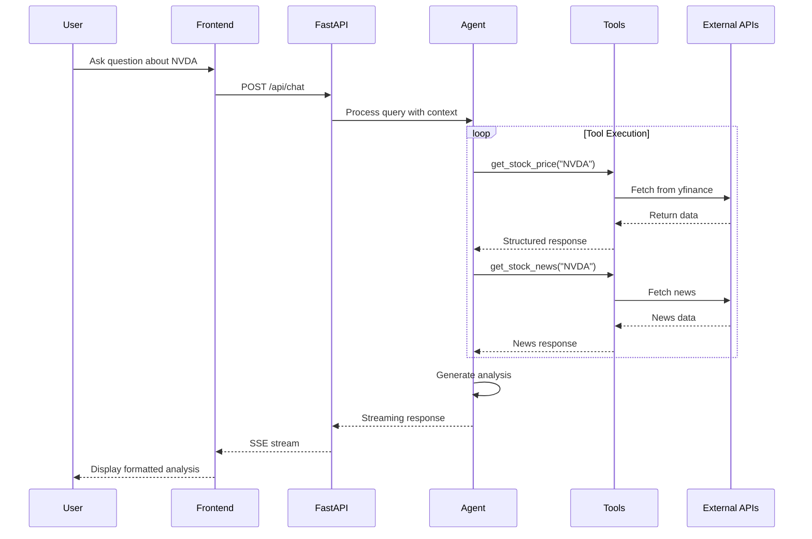

# 📊 Nexus Financial Analyst

> **AI-Powered Financial Analysis Assistant** - A comprehensive platform combining LangChain agents with real-time market data to deliver professional stock analysis, market briefings, and comparative analytics.

[🇧🇷 Versão em Português](./README.pt-BR.md)

## 🎯 Overview

Nexus Financial Analyst is an intelligent financial analysis platform that leverages AI agents to provide:
- **Stock Analyzer**: Deep dive analysis of individual stocks with historical data, financials, and news
- **Market Pulse**: Pre-market and intraday briefings with top movers and macro trends
- **Stock Showdown**: Head-to-head comparative analysis of multiple tickers

The system uses LangChain agents with specialized tools to fetch real-time data from yfinance and Tavily, providing data-driven insights with compliance-aware responses.

## 🎥 Video Demonstration

See the platform in action:

https://github.com/user-attachments/assets/nexus-financial-analyst-demo.mp4

## 🏗️ Architecture



## 🔄 Data Flow



## ✨ Features

### 🔍 Stock Analyzer
- Real-time price snapshots and market cap
- 1-year historical price charts
- Balance sheet and key financial metrics
- Company facts and sector information
- 7-day news feed with source citations
- Multi-dimensional analysis (Growth, Profitability, Valuation, Risk)

### 📈 Market Pulse
- Watchlist monitoring with price snapshots
- Top movers identification by sector
- Macro headlines and market implications
- Pre-market and intraday briefings
- Sector performance visualization

### ⚔️ Stock Showdown
- Side-by-side comparison of 2-4 tickers
- Indexed returns analysis (1Y and 5Y)
- Comparative metrics (valuation, growth, profitability)
- Leverage and liquidity comparison
- News and catalyst identification

### 🛡️ Compliance & Safety
- Professional, neutral, data-driven tone
- "Not financial advice" disclaimers
- Source citations with publisher and date
- Data limitation transparency
- Follow-up questions to guide deeper analysis

## 🛠️ Technology Stack

### Backend
- **Framework**: FastAPI
- **AI/ML**: LangChain, LangGraph, OpenAI API
- **Data Sources**: yfinance (market data), Tavily (web search)
- **Language**: Python 3.10+
- **Package Manager**: uv / pip

### Frontend
- **Framework**: React 19 + TypeScript
- **Build Tool**: Vite
- **UI Library**: GenUI SDK (@thesysai/genui-sdk)
- **Styling**: Crayon UI, TailwindCSS, SASS
- **Linting**: ESLint with TypeScript support

## 📋 Prerequisites

- **Node.js** 18+ (for frontend)
- **Python** 3.10+ (for backend)
- **OpenAI API Key** or compatible LLM endpoint
- **Tavily API Key** (for web search functionality)

## 🚀 Setup & Installation

### 1. Clone the Repository

```bash
git clone https://github.com/andrecodea/nexus-financial-analyst.git
cd nexus-financial-analyst
```

### 2. Backend Setup

```bash
cd backend

# Create virtual environment
python -m venv .venv

# Activate virtual environment
# Windows:
.venv\Scripts\activate
# macOS/Linux:
source .venv/bin/activate

# Install dependencies
pip install -r requirements.txt
# OR using the project's pyproject.toml:
pip install .
```

### 3. Environment Configuration

Create a `.env` file in the `backend` directory:

```bash
# Copy example environment file
cp ../.env.example backend/.env

# Edit backend/.env with your API keys
```

Required environment variables:
```env
LLM_NAME=gpt-4o-mini                    # or your preferred model
LLM_BASE_URL=https://api.openai.com/v1  # OpenAI or compatible endpoint
OPENAI_API_KEY=your-openai-api-key-here
TAVILY_API_KEY=your-tavily-api-key-here
```

### 4. Frontend Setup

```bash
cd frontend

# Install dependencies
npm install

# Start development server
npm run dev
```

### 5. Run the Application

**Terminal 1 - Backend:**
```bash
cd backend
uvicorn main:app --reload --port 8000
```

**Terminal 2 - Frontend:**
```bash
cd frontend
npm run dev
```

Access the application at `http://localhost:5173` (or the port shown by Vite)

## 🔧 Available Tools

The agent has access to these specialized tools:

| Tool | Description | Parameters |
|------|-------------|------------|
| `get_stock_price` | Real-time stock price | `ticker` (e.g., "NVDA") |
| `get_historical_stock_price` | Historical price data | `ticker`, `start_date`, `end_date` |
| `get_balance_sheet` | Company balance sheet | `ticker` |
| `get_stock_news` | Latest stock news | `ticker` |
| `web_search` | Web search via Tavily | `query` |

## 📝 API Endpoints

### POST `/api/chat`

Stream chat responses from the financial agent.

**Request Body:**
```json
{
  "message": "Analyze NVDA stock",
  "thread_id": "optional-session-id"
}
```

**Response:** Server-Sent Events (SSE) stream with agent responses

## 🐛 Troubleshooting

### Backend Issues

**Issue: `ModuleNotFoundError: No module named 'langchain'`**
```bash
# Ensure virtual environment is activated
source .venv/bin/activate  # or .venv\Scripts\activate on Windows
pip install -r requirements.txt
```

**Issue: `OpenAI API key not found`**
```bash
# Verify .env file exists in backend directory
# Check that OPENAI_API_KEY is set
cat backend/.env | grep OPENAI_API_KEY
```

### Frontend Issues

**Issue: Port already in use**
```bash
# Change port in vite.config.ts or kill process on port 5173
# Linux/Mac:
lsof -ti:5173 | xargs kill -9
# Windows:
netstat -ano | findstr :5173
taskkill /PID <PID> /F
```

**Issue: CORS errors**
- Ensure backend is running on port 8000
- Check CORS middleware configuration in `backend/main.py`

## 🔒 Security Notes

⚠️ **Important Security Information:**

- **Never commit** `.env` files or files containing secrets
- The repository history was previously rewritten to remove exposed keys
- **You MUST rotate any API keys** that may have been exposed
- After history rewrite, collaborators should re-clone:
  ```bash
  git clone https://github.com/andrecodea/nexus-financial-analyst.git
  ```
- Use `backend/.env.example` as the template for environment variables
- Add `.env` files to `.gitignore` (already configured)

📋 **Security Resources:**

- See [SECURITY.md](./SECURITY.md) for comprehensive security guidelines and best practices
- See [VALIDATION_REPORT.md](./VALIDATION_REPORT.md) for security validation results
- Review the production deployment checklist before going live

The project has been validated for data leaks and security vulnerabilities. See the validation report for details.

## 🤝 Contributing

1. Fork the repository
2. Create a feature branch (`git checkout -b feature/amazing-feature`)
3. Commit your changes (`git commit -m 'Add amazing feature'`)
4. Push to the branch (`git push origin feature/amazing-feature`)
5. Open a Pull Request

### Development Guidelines

- Follow existing code style and conventions
- Add tests for new features
- Update documentation as needed
- Ensure linting passes: `npm run lint` (frontend) / follow PEP 8 (backend)
- Test thoroughly before submitting PR

## 📄 License

This project is provided as-is for educational and development purposes.

## 🙏 Acknowledgments

- [LangChain](https://python.langchain.com/) - Agent framework
- [yfinance](https://github.com/ranaroussi/yfinance) - Market data
- [Tavily](https://tavily.com/) - Web search API
- [FastAPI](https://fastapi.tiangolo.com/) - Backend framework
- [React](https://react.dev/) - Frontend library
- [GenUI SDK](https://github.com/thesysai/genui-sdk) - Chat interface

---

**Disclaimer**: This is not financial advice. This tool is for informational and educational purposes only. Always conduct your own research and consult with qualified financial advisors before making investment decisions.
