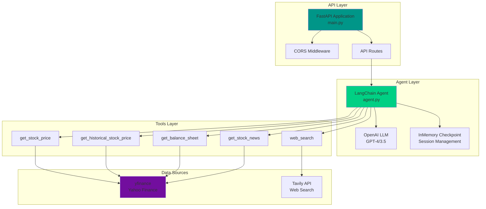
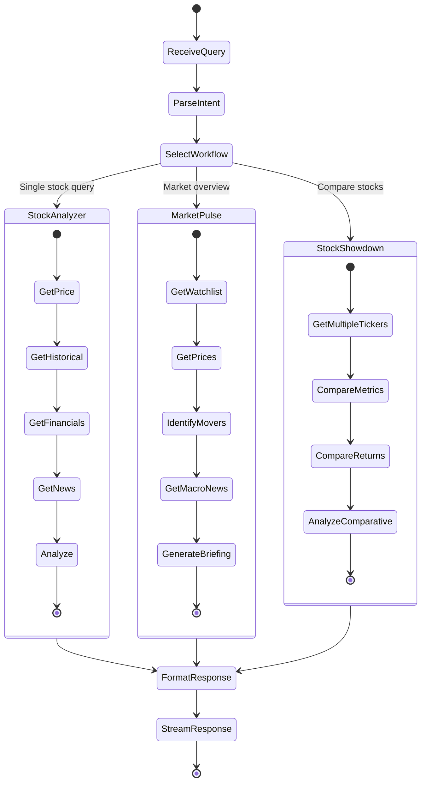

# 🔧 Nexus Financial Analyst - Backend

FastAPI backend with LangChain agents for intelligent financial analysis.

## 📋 Overview

The backend provides an AI-powered financial analysis API using LangChain agents with specialized tools to fetch and analyze stock market data. It uses OpenAI's language models to deliver professional stock analysis, market briefings, and comparative analytics.

## 🏗️ Architecture



## 🔄 Agent Workflow



## ✨ Features

### 🤖 AI Agent Capabilities

- **Intelligent Query Parsing**: Understands natural language financial queries
- **Multi-Tool Orchestration**: Automatically selects and combines tools
- **Contextual Memory**: Maintains conversation context across messages
- **Streaming Responses**: Real-time response generation
- **Compliance-Aware**: Includes disclaimers and professional tone

### 🛠️ Available Tools

| Tool | Purpose | Data Source | Parameters |
|------|---------|-------------|------------|
| `get_stock_price` | Current stock price | yfinance | `ticker` |
| `get_historical_stock_price` | Historical price data | yfinance | `ticker`, `start_date`, `end_date` |
| `get_balance_sheet` | Company balance sheet | yfinance | `ticker` |
| `get_stock_news` | Latest stock news | yfinance | `ticker` |
| `web_search` | General web search | Tavily | `query` |

### 📊 Analysis Workflows

#### 1. Stock Analyzer
Deep dive analysis of individual stocks:
- Price snapshot and market cap
- 1-year historical price chart
- Key financial metrics (P/E, market cap, etc.)
- Balance sheet data
- 7-day news feed
- Multi-dimensional analysis (Growth, Profitability, Valuation, Risk)

#### 2. Market Pulse
Pre-market and intraday briefings:
- Watchlist price snapshots
- Top movers by sector
- Macro headlines and implications
- Sector performance visualization

#### 3. Stock Showdown
Comparative analysis of 2-4 stocks:
- Side-by-side metric comparison
- Indexed returns (1Y and 5Y)
- Valuation, growth, and profitability analysis
- News and catalyst identification

## 🛠️ Technology Stack

- **FastAPI** - Modern async web framework
- **LangChain** - Agent and tool orchestration
- **LangGraph** - Agent workflow management
- **OpenAI API** - Language model provider
- **yfinance** - Stock market data
- **Tavily** - Web search API
- **Pydantic** - Data validation
- **python-dotenv** - Environment management
- **Uvicorn** - ASGI server

## 📦 Project Structure

```
backend/
├── agent.py          # Agent initialization and configuration
├── main.py           # FastAPI application and routes
├── tools.py          # Tool definitions (stock data, search)
├── schemas.py        # Pydantic data models
├── prompt.toml       # System prompt and instructions
├── pyproject.toml    # Project metadata and dependencies
├── .env.example      # Environment variable template
├── .env              # Local environment (DO NOT COMMIT)
├── .gitignore        # Git ignore rules
└── README.md         # This file
```

## 🚀 Getting Started

### Prerequisites

- Python 3.10+
- OpenAI API key
- Tavily API key (for web search)

### Installation

```bash
cd backend

# Create virtual environment
python -m venv .venv

# Activate virtual environment
# Windows (PowerShell):
.venv\Scripts\Activate.ps1
# Windows (CMD):
.venv\Scripts\activate
# macOS/Linux:
source .venv/bin/activate

# Install dependencies
pip install -r requirements.txt
# OR using pyproject.toml:
pip install .
```

### Environment Configuration

Create a `.env` file in the backend directory:

```bash
cp ../.env.example .env
```

Edit `.env` with your API keys:

```env
# LLM Configuration
LLM_NAME=gpt-4o-mini
LLM_BASE_URL=https://api.openai.com/v1

# API Keys
OPENAI_API_KEY=sk-your-openai-api-key-here
TAVILY_API_KEY=tvly-your-tavily-api-key-here
```

### Run the Server

```bash
# Development mode with auto-reload
uvicorn main:app --reload --port 8000

# Production mode
uvicorn main:app --host 0.0.0.0 --port 8000
```

The API will be available at `http://localhost:8000`

### API Documentation

Once running, access the interactive API docs:
- Swagger UI: `http://localhost:8000/docs`
- ReDoc: `http://localhost:8000/redoc`

## 📝 API Endpoints

### POST `/api/chat`

Stream chat responses from the financial agent.

**Request:**
```json
{
  "message": "Analyze NVDA stock performance",
  "thread_id": "optional-session-id"
}
```

**Response:**
Server-Sent Events (SSE) stream with agent responses.

**Example with curl:**
```bash
curl -X POST http://localhost:8000/api/chat \
  -H "Content-Type: application/json" \
  -d '{
    "message": "What is the current price of NVDA?",
    "thread_id": "test-session-1"
  }'
```

**Example with Python:**
```python
import requests
import json

url = "http://localhost:8000/api/chat"
data = {
    "message": "Analyze TSLA stock",
    "thread_id": "my-session"
}

response = requests.post(url, json=data, stream=True)
for line in response.iter_lines():
    if line:
        print(line.decode('utf-8'))
```

## 🔧 Development

### Adding New Tools

1. Define the tool in `tools.py`:

```python
from langchain.tools import tool

@tool(
    "my_new_tool",
    description="Description of what the tool does"
)
def my_new_tool(param: str):
    """Detailed docstring"""
    # Implementation
    return result
```

2. Register in `agent.py`:

```python
tools = [
    get_stock_price,
    # ... other tools
    my_new_tool,  # Add your tool here
]
```

### Modifying the System Prompt

Edit `prompt.toml` to customize agent behavior:

```toml
prompt = """
[ROLE]
Your custom role definition...

[WORKFLOWS]
Your custom workflows...
"""
```

Then load it in `main.py`:

```python
import tomllib

with open("prompt.toml", "rb") as f:
    config = tomllib.load(f)
    system_message = config["prompt"]
```

### Testing Tools

Test individual tools in Python:

```python
from tools import get_stock_price, get_stock_news

# Test stock price
price = get_stock_price.invoke({"ticker": "AAPL"})
print(f"AAPL price: ${price}")

# Test stock news
news = get_stock_news.invoke({"ticker": "TSLA"})
print(f"TSLA news: {news}")
```

## 🧪 Testing

### Manual Testing

Use the interactive docs at `http://localhost:8000/docs` to test endpoints.

### Command Line Testing

```bash
# Test with curl
curl -X POST http://localhost:8000/api/chat \
  -H "Content-Type: application/json" \
  -d '{"message": "What is AAPL trading at?", "thread_id": "test"}'
```

### Python Testing

```python
import requests

response = requests.post(
    "http://localhost:8000/api/chat",
    json={
        "message": "Compare AAPL and MSFT",
        "thread_id": "comparison-test"
    },
    stream=True
)

for chunk in response.iter_content(chunk_size=None):
    print(chunk.decode('utf-8'), end='')
```

## 🔒 Security

### Security Features ✅

The backend implements comprehensive security measures:

- **CORS Protection**: Configured with explicit origin allowlist
- **Security Headers**: X-Content-Type-Options, X-Frame-Options, X-XSS-Protection
- **Input Validation**: Message content and length validation (10K char max)
- **Secure Logging**: Structured logging without sensitive data exposure
- **Environment Validation**: Required variables checked at startup
- **Error Handling**: Generic error messages prevent information disclosure

See [SECURITY.md](../SECURITY.md) for complete security guidelines and [VALIDATION_REPORT.md](../VALIDATION_REPORT.md) for security audit results.

### Environment Variables

- **Never commit** `.env` files
- Use `.env.example` as a template
- Rotate API keys if exposed

### API Keys

Required API keys:
- **OPENAI_API_KEY**: For LLM access
- **TAVILY_API_KEY**: For web search functionality

### CORS Configuration

CORS is configured in `main.py` with restricted origins. Update for production:

```python
app.add_middleware(
    CORSMiddleware,
    allow_origins=["https://your-frontend-domain.com"],
    allow_credentials=True,
    allow_methods=["*"],
    allow_headers=["*"],
)
```

Current development configuration:
```python
allow_origins=["http://localhost:5173", "http://localhost:3000"]
```

### Security Headers

All responses include security headers:
- `X-Content-Type-Options: nosniff` - Prevents MIME sniffing
- `X-Frame-Options: DENY` - Prevents clickjacking
- `X-XSS-Protection: 1; mode=block` - XSS protection

### Input Validation

The API validates all inputs:
- Empty content is rejected (HTTP 400)
- Messages > 10,000 characters are rejected (HTTP 400)
- Invalid request structures are rejected by Pydantic validation

### Logging Security

- All `print()` statements replaced with structured logging
- Query content truncated to 50 characters in logs
- API keys never logged
- Only error types logged, not sensitive details

## 🐛 Troubleshooting

### Import Errors

```bash
# Ensure virtual environment is activated
source .venv/bin/activate  # or .venv\Scripts\activate on Windows

# Reinstall dependencies
pip install -r requirements.txt
```

### API Key Errors

```bash
# Verify .env file exists and contains keys
cat .env | grep API_KEY

# Ensure .env is in backend directory
ls -la | grep .env
```

### Port Already in Use

```bash
# Find process using port 8000
# Linux/Mac:
lsof -i :8000

# Windows:
netstat -ano | findstr :8000

# Kill the process or use a different port
uvicorn main:app --reload --port 8001
```

### yfinance Data Issues

If yfinance returns empty data:
- Check if the ticker symbol is valid
- Verify market hours (some data only available during trading)
- Try a different ticker to isolate the issue
- Check yfinance GitHub for known issues

## 📚 Resources

- [FastAPI Documentation](https://fastapi.tiangolo.com/)
- [LangChain Documentation](https://python.langchain.com/)
- [yfinance Documentation](https://github.com/ranaroussi/yfinance)
- [Tavily API](https://docs.tavily.com/)
- [OpenAI API](https://platform.openai.com/docs)

## 🤝 Contributing

1. Follow PEP 8 style guidelines
2. Add docstrings to new functions and classes
3. Test new tools thoroughly
4. Update documentation for new features
5. Ensure API keys are not committed

---

For frontend documentation, see [Frontend README](../frontend/README.md)
