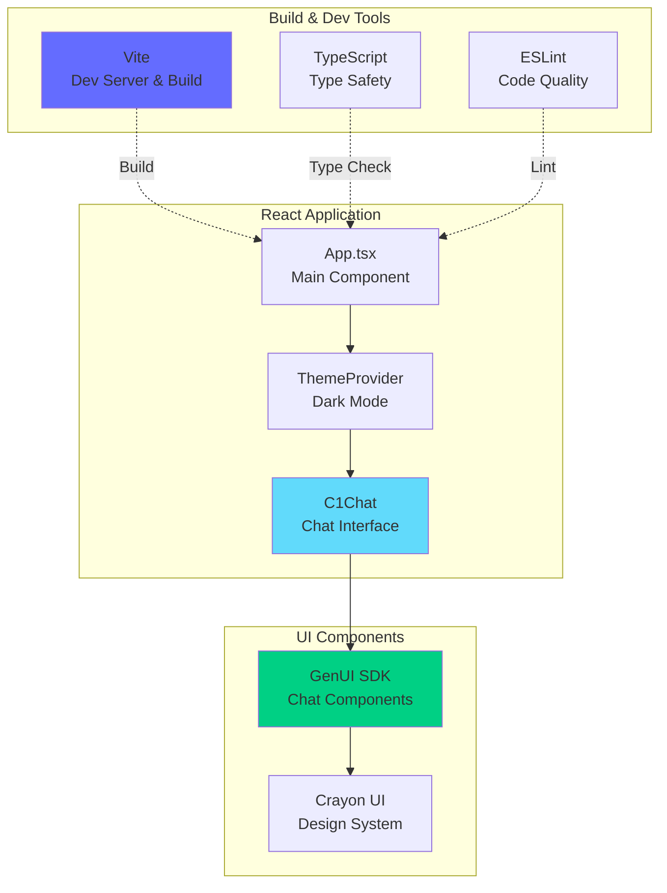
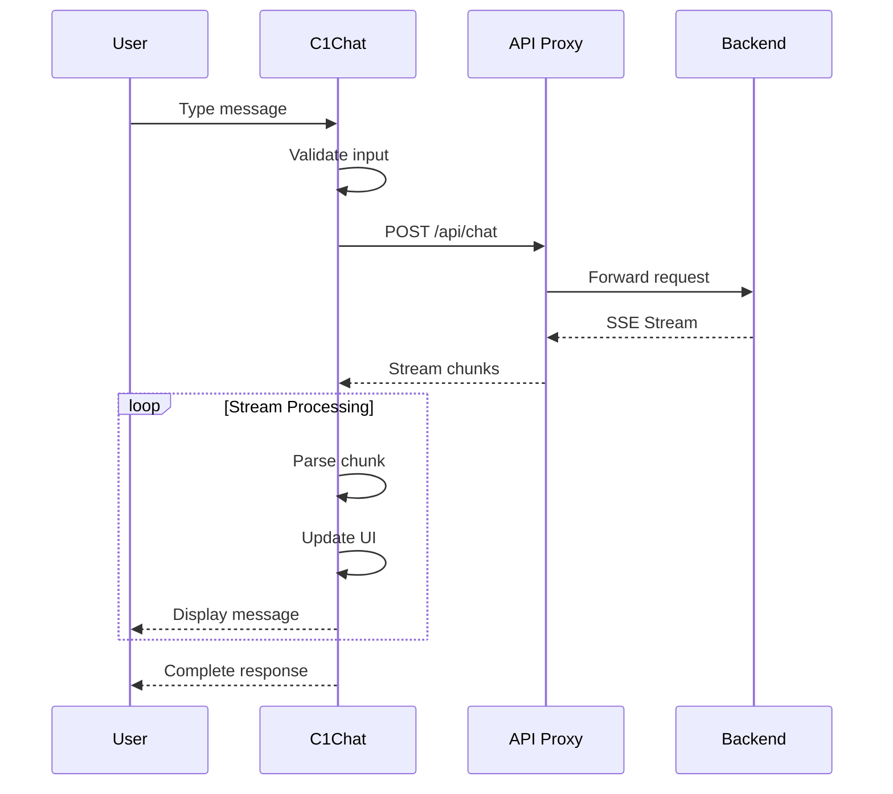

# 🎨 Nexus Financial Analyst - Frontend

React + TypeScript + Vite frontend for the Nexus Financial Analyst platform.

## 📋 Overview

The frontend provides an interactive chat interface for financial analysis using the GenUI SDK. It communicates with the FastAPI backend to deliver real-time AI-powered stock analysis, market briefings, and comparative analytics.

## 🎥 Video Demonstration

See the platform in action:

https://github.com/user-attachments/assets/nexus-financial-analyst-demo.mp4

## 🏗️ Architecture



## 🔄 Component Flow



## ✨ Features

- **Interactive Chat Interface**: Real-time conversation with the financial agent
- **Dark Mode**: Professional dark theme using ThemeProvider
- **Server-Sent Events (SSE)**: Streaming responses for immediate feedback
- **Responsive Design**: Mobile-friendly interface
- **Type Safety**: Full TypeScript support for robust development
- **Hot Module Replacement (HMR)**: Fast development with instant updates

## 🛠️ Technology Stack

- **React** 19.2.0 - UI framework
- **TypeScript** 5.9.3 - Type safety
- **Vite** 7.2.4 - Build tool and dev server
- **GenUI SDK** 0.7.11 - Chat interface components
- **Crayon UI** 0.9.8 - Design system components
- **TailwindCSS** 4.1.18 - Utility-first CSS
- **SASS** 1.97.1 - CSS preprocessing

## 📦 Project Structure

```
frontend/
├── src/
│   ├── App.tsx           # Main application component
│   ├── App.css           # Application styles
│   ├── main.tsx          # Entry point
│   └── assets/           # Static assets (images, icons)
├── public/               # Public static files
├── index.html            # HTML template
├── vite.config.ts        # Vite configuration
├── tsconfig.json         # TypeScript configuration
├── tsconfig.app.json     # App-specific TS config
├── tsconfig.node.json    # Node-specific TS config
├── eslint.config.js      # ESLint configuration
├── package.json          # Dependencies and scripts
└── README.md            # This file
```

## 🚀 Getting Started

### Prerequisites

- Node.js 18+ 
- npm or yarn

### Installation

```bash
# Install dependencies
npm install

# Start development server
npm run dev
```

The application will start at `http://localhost:5173` (or another port if 5173 is busy).

### Development

```bash
# Run development server with hot reload
npm run dev

# Build for production
npm run build

# Preview production build
npm run preview

# Run linter
npm run lint
```

## ⚙️ Configuration

### Vite Configuration

The Vite configuration includes:
- React plugin with Fast Refresh
- Proxy configuration for API requests
- Build optimizations

Example proxy configuration in `vite.config.ts`:

```typescript
export default defineConfig({
  plugins: [react()],
  server: {
    proxy: {
      '/api': {
        target: 'http://localhost:8000',
        changeOrigin: true,
      },
    },
  },
})
```

### Environment Variables

Create a `.env.local` file for local environment variables:

```env
VITE_API_URL=http://localhost:8000
```

Access in code:
```typescript
const apiUrl = import.meta.env.VITE_API_URL
```

## 🎨 Customization

### Theme Customization

The app uses the GenUI ThemeProvider in dark mode:

```typescript
<ThemeProvider mode='dark'>
  <C1Chat 
    apiUrl='/api/chat' 
    agentName='Nexus Financial Analyst' 
    logoUrl='src/assets/favicon.svg'
  />
</ThemeProvider>
```

To customize:
- Change `mode` to `'light'` for light theme
- Update `agentName` for different branding
- Replace `logoUrl` with your custom logo

### Styling

The project uses multiple styling approaches:
- **TailwindCSS**: Utility classes in components
- **SASS/SCSS**: Component-specific styles
- **Crayon UI**: Pre-built design system components
- **CSS Modules**: Scoped component styles

## 🧪 ESLint Configuration

The project uses ESLint with TypeScript support. The configuration includes:

- `@eslint/js` - Core ESLint rules
- `typescript-eslint` - TypeScript-specific rules
- `eslint-plugin-react-hooks` - React Hooks rules
- `eslint-plugin-react-refresh` - React Refresh rules

### Expanding ESLint

For production applications, enable type-aware lint rules:

```js
export default defineConfig([
  globalIgnores(['dist']),
  {
    files: ['**/*.{ts,tsx}'],
    extends: [
      tseslint.configs.recommendedTypeChecked,
      // or for stricter rules:
      tseslint.configs.strictTypeChecked,
    ],
    languageOptions: {
      parserOptions: {
        project: ['./tsconfig.node.json', './tsconfig.app.json'],
        tsconfigRootDir: import.meta.dirname,
      },
    },
  },
])
```

## 🔧 Troubleshooting

### Port Already in Use

If port 5173 is already in use:

```bash
# Linux/Mac
lsof -ti:5173 | xargs kill -9

# Windows
netstat -ano | findstr :5173
taskkill /PID <PID> /F
```

Or change the port in `vite.config.ts`:

```typescript
export default defineConfig({
  server: {
    port: 3000,
  },
})
```

### CORS Issues

Ensure the backend is running and the proxy is correctly configured:

1. Backend should be running on `http://localhost:8000`
2. Check proxy configuration in `vite.config.ts`
3. Verify CORS middleware in backend `main.py`

### Build Errors

```bash
# Clean install
rm -rf node_modules package-lock.json
npm install

# Clear Vite cache
rm -rf node_modules/.vite
npm run dev
```

## 🚀 Production Build

Build optimized production bundle:

```bash
npm run build
```

This creates a `dist/` folder with optimized assets:
- Minified JavaScript
- Optimized CSS
- Compressed assets
- Source maps (optional)

### Preview Production Build

```bash
npm run preview
```

Serves the production build locally for testing.

## 📚 Resources

- [React Documentation](https://react.dev/)
- [Vite Documentation](https://vite.dev/)
- [TypeScript Documentation](https://www.typescriptlang.org/)
- [GenUI SDK](https://github.com/thesysai/genui-sdk)
- [Crayon UI](https://github.com/crayonai/react-ui)
- [TailwindCSS](https://tailwindcss.com/)

## 🤝 Contributing

1. Follow the existing code style
2. Run linter before committing: `npm run lint`
3. Test your changes thoroughly
4. Update documentation as needed

---

For backend documentation, see [Backend README](../backend/README.md)
